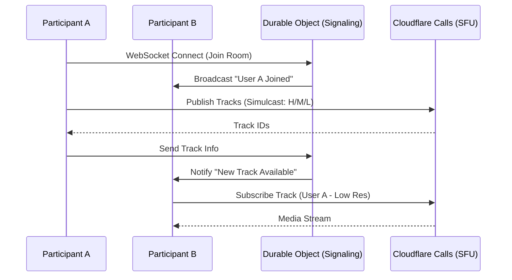

# SFU 다자간 회의 시스템 아키텍처 분석 보고서

## 1. 현재 구조 분석 (AS-IS)

현재 `res200 > workers > templates > sfuTemplate.js`와 관련 모듈(`WebRTCManager.js`, `webrtc-worker.js`)의 구조는 다음과 같은 한계를 가지고 있습니다.

### 1.1 시그널링 방식의 한계 (KV Polling)
* **문제점**: 현재 백엔드는 Cloudflare KV를 이용한 **HTTP Polling** 방식으로 시그널링 메시지를 교환합니다.
* **영향**: 참여자가 늘어날수록 KV 읽기/쓰기 횟수가 기하급수적으로 증가하며, 최소 수초의 지연 시간이 발생합니다. 실시간 대화에서 '수초의 지연'은 대화의 흐름을 끊는 결정적인 요인입니다.

### 1.2 미디어 전송 최적화 부재 (No Simulcast)
* **문제점**: 모든 참여자가 단일 고해상도 스트림을 전송하고 수신합니다.
* **영향**: 5명만 접속해도 각 사용자는 4개의 고해상도 영상을 동시에 수신해야 합니다. 이는 클라이언트의 CPU 부하와 네트워크 대역폭 고갈을 초래하여 끊김 현상을 유발합니다.

### 1.3 동적 트랙 관리 미비
* **문제점**: 화면에 보이지 않는 참여자의 영상 트랙도 항상 수신하며, 화자(Active Speaker)를 구분하는 로직이 없습니다.
* **영향**: 구글 미트와 같은 부드러운 화자 전환 및 대규모 세션 유지가 불가능합니다.

---

## 2. 개선 제안 구조 (TO-BE)

구글 미트 수준의 성능과 안정성을 확보하기 위해 다음과 같은 구조적 전환이 필요합니다.

### 2.1 시그널링의 실시간화: Durable Objects 도입
* **내용**: Cloudflare Workers의 **Durable Objects(DO)**와 **WebSockets**를 사용하여 상태 기반 시그널링 서버를 구축합니다.
* **이점**: 메시지 전달 지연 시간이 밀리초(ms) 단위로 단축되며, 방의 상태(참여자 목록 등)를 메모리상에서 즉각 공유할 수 있습니다.

### 2.2 사이멀캐스트(Simulcast) 적용
* **내용**: 클라이언트가 영상 송신 시 단일 해상도가 아닌, **High(720p), Medium(360p), Low(180p)** 세 가지 레이어를 동시에 송신합니다.
* **이점**: SFU(Cloudflare Calls)가 각 수신자의 상황(네트워크 상태, 그리드 크기)에 맞는 최적의 해상도만 골라서 전달하여 대역폭을 획기적으로 절약합니다.

### 2.3 화자 감지(Active Speaker Detection) 기반 UI/UX
* **내용**: Web Audio API를 사용하여 로컬 오디오의 음량을 실시간 체크하고, 화자 정보를 시그널링 서버를 통해 공유합니다.
* **이점**: 주 화자(Speaker View) 위주로 레이아웃을 자동 전환하고, 배경 참여자의 영상은 저해상도로 낮추거나 일시 중지하여 성능을 극대화합니다.

### 2.4 동적 대역폭 관리 (Adaptive Bitrate)
* **내용**: 네트워크 혼잡 시 비트레이트를 자동으로 조절하는 기능을 활성화합니다.

---

## 3. 세부 수정 로직 및 구조도

### 3.1 백엔드 구조 변경 (Mermaid)

### 3.2 필요 수정 파일 목록
1. **webrtc-worker.js**: Durable Object 핸들러 추가 및 WebSocket 처리 로직 구현.
2. **WebRTCManager.js**: `RTCRtpTransceiver`를 통한 Simulcast 인코딩 설정 추가.
3. **SignalingClient.js**: Polling 방식을 WebSocket 방식으로 전면 개편.
4. **MediaManager.js**: 오디오 레벨 모니터링 기능 추가.
